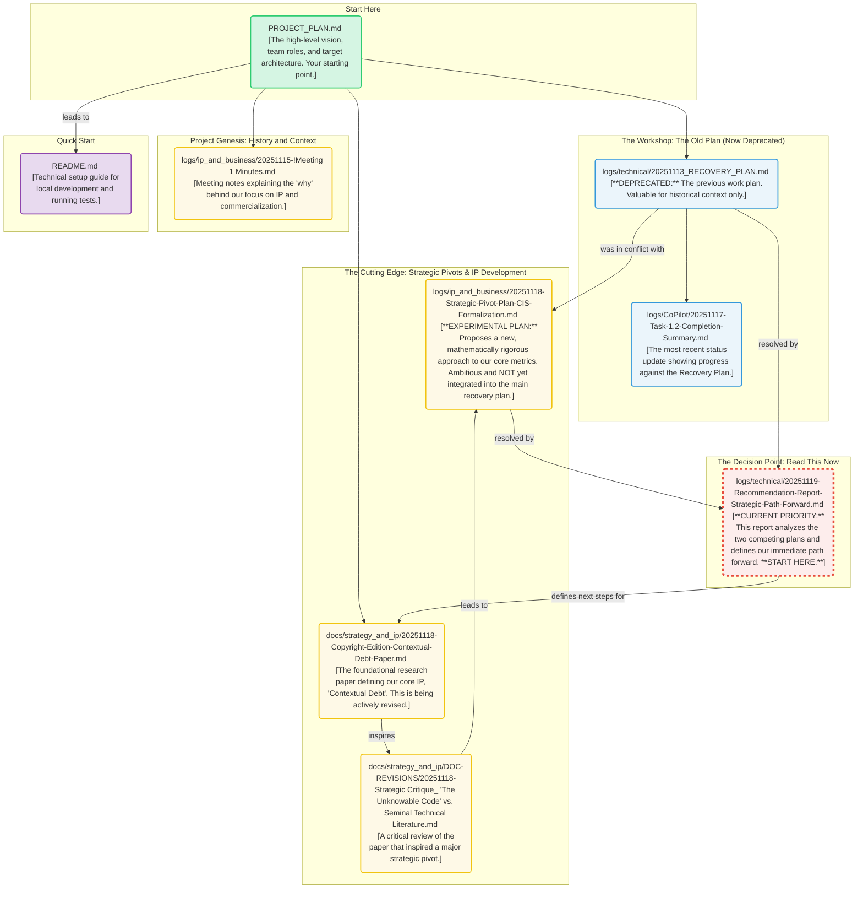

# Strategic Master Log (2025-11-19)

## **CURRENT STATUS (2025-11-19): Strategic Inflection Point**

**Attention New Team Members:** You are joining the project at a critical and exciting moment. We have just completed an analysis that has resulted in a major strategic decision.

The project is currently at a strategic inflection point, moving from a prototype-based technical plan to a more rigorous, mathematically-defined approach for our core IP. The tension between our old `RECOVERY_PLAN` and a proposed `Strategic-Pivot-Plan` has now been resolved.

**Your first action is to read the following report:**
*   **`logs/technical/20251119-Recommendation-Report-Strategic-Path-Forward.md`**: This document provides the official analysis and justification for our immediate path forward. It is the definitive source of truth for the project's current priorities.

The flowchart and document descriptions below provide essential historical context, but the recommendation report above is your guide for what we are doing *right now*.

## A Guide for Humans and AI Agents

Welcome to the LogoMesh project. This document is a master log designed for two distinct audiences:
1.  **For Human Developers:** It serves as a guided tour through our project's key documents, helping you understand our high-level strategy, current technical plans, and core intellectual property.
2.  **For AI Agents:** It acts as a primary context file. The structured format and explicit linking of documents are designed to be parsed by AI development assistants (like GitHub Copilot or Jules) to provide accurate, context-aware answers and generate relevant code.

Our goal is to maintain a "living document" that bridges the gap between human understanding and machine-readable context, mitigating the very "Contextual Debt" our project aims to solve.

## Documentation Flowchart: A "Choose Your Own Adventure"

> **Note:** The diagram below shows the key documents that led to our current strategic decision. The most important node for you to focus on now is the **Recommendation Report**, which resolves the conflict between the two main technical plans.

This diagram provides a high-level map of the project's documentation. Start with the `PROJECT_PLAN.md` to understand the overall vision, then explore the different paths based on your area of interest.

---

## 1. The Big Picture: Core Strategy & Vision

This section provides the high-level context for the entire project. If you are new, start here to understand our goals and the problems we are trying to solve.

*   **`PROJECT_PLAN.md`**: This is the canonical starting point for any new team member. It outlines our strategic vision for the AgentX competition, defines the "Cyber-Sentinel Agent" narrative, details team roles, and describes the target multi-agent architecture. It is the "what" and "why" of our project. While it agrees with the current technical plan, it is intentionally less detailed.

---

## 2. The Workshop: Historical Technical Plan

This section details the engineering work that was being performed *prior* to our current strategic pivot. These documents are now primarily for historical context.

*   **`logs/technical/20251113_RECOVERY_PLAN.md`**: **(DEPRECATED)** This was the project's previous tactical source of truth. It is preserved here to provide context for the decisions made in the `Recommendation-Report`. It should not be used as a guide for current work.

*   **`logs/CoPilot/20251117-Task-1.2-Completion-Summary.md`**: This is the most recent changelog or status report for the codebase. It documents the completion of a specific task from the `RECOVERY_PLAN.md`, providing a snapshot of our recent progress and technical decisions.

---

## 3. The Cutting Edge: Strategic Pivots & IP Development

This section contains the project's most ambitious and forward-looking ideas. The documents here define our core intellectual property and explore the major evolution of our technical strategy that we are now formally adopting.

*   **`docs/strategy_and_ip/20251118-Copyright-Edition-Contextual-Debt-Paper.md`**: This is the foundational document for our entire project. It defines the concept of "Contextual Debt," which is our core intellectual property and the central problem we aim to solve. The latest version has been updated to prepare it for a formal copyright application.

*   **`docs/strategy_and_ip/DOC-REVISIONS/20251118-Strategic Critique_ 'The Unknowable Code' vs. Seminal Technical Literature.md`**: This is a deep, critical analysis of the research paper. It argues that to be truly groundbreaking, our "Contextual Integrity Score (CIS)" must evolve from a rubric into a mathematically rigorous formula. This critique is the direct inspiration for the experimental pivot plan.

*   **`logs/ip_and_business/20251118-Strategic-Pivot-Plan-CIS-Formalization.md`**: **(Experimental & Ambitious)** This document outlines a concrete plan to implement the ideas from the "Strategic Critique." It proposes a new, more advanced technical direction for our core analyzers, based on vector embeddings and graph theory. While this plan is the likely future of the project, it is **not** the plan we are currently executing. It represents a major potential pivot that is still under investigation.

---

## 4. Project Genesis: History and Context

This section provides historical context that explains key strategic decisions and the project's origins.

*   **`logs/ip_and_business/20251115-!Meeting 1 Minutes.md`**: These are the notes from the first formal meeting between teammates Josh and Deepti. This document is the primary source for understanding *why* the project has a strong focus on intellectual property, copyright, and commercialization, as it records the moment these strategic initiatives were formally adopted.

---

## 5. Getting Started: Local Setup & Quick Start

While this master log provides the strategic "why," the root `README.md` provides the tactical "how" for getting the project running on your local machine. It is the best place to start for hands-on development or data analysis.

*   **`README.md`**: The primary entry point for technical onboarding. It contains:
    *   Prerequisites and detailed setup instructions for the development environment (Node.js, Docker, etc.).
    *   Step-by-step commands for installing dependencies, building the project, and running the end-to-end tests.
    *   Role-specific guidance with quick links for both Data Scientists and Engineers.

### Key Technical & Onboarding Documents (from `README.md`)

*   **For Data Scientists:**
    *   Gap Analysis & Onboarding Plan: `docs/GAP_ANALYSIS_FOR_DATASCIENTIST.md`
    *   Metric Specification: `docs/CONTEXTUAL_DEBT_SPEC.md`
    *   Evaluation Output Schema: `docs/EVAL_OUTPUT_SCHEMA.md`
    *   Example Notebook: `notebooks/01-explore-sample-eval.ipynb`
    *   Helper Scripts: `tools/`

*   **For Engineers:**
    *   Project Status: `docs/PROJECT_STATUS.md`
    *   CI/CD Workflow: `docs/CI_COMPOSE_E2E_WORKFLOW.md`
